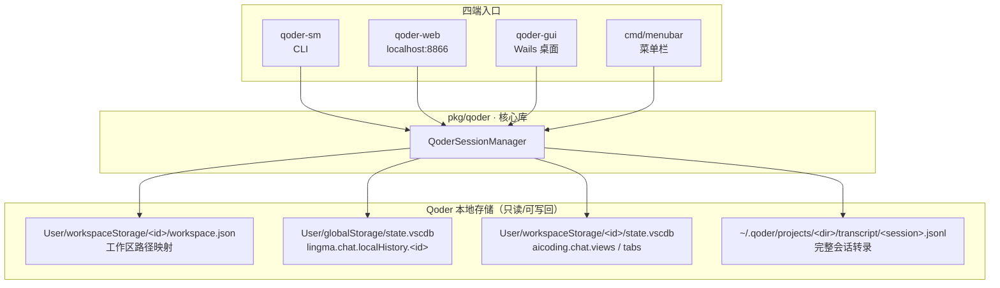
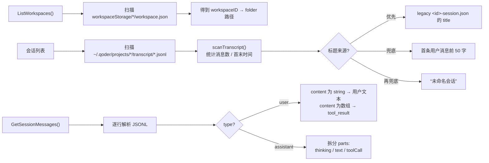
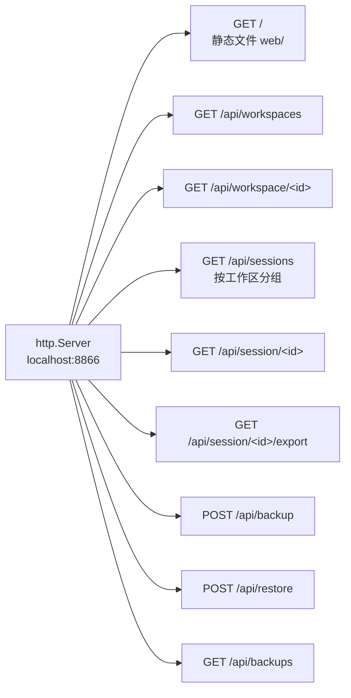
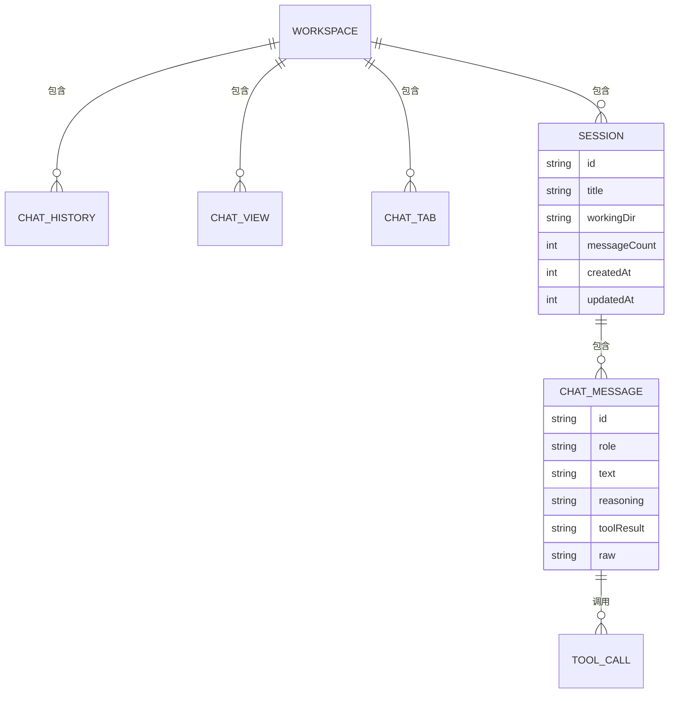

<div align="center">

> [English](./README_en.md) | **简体中文**


# QoderSM · Qoder 会话管理器

**换号不再丢会话 —— 一键备份 / 恢复 / 导出 Qoder IDE 的全部聊天记录**

把「切换账号后历史对话消失」这件烦心事，变成一个按钮。


</div>

---

## 它解决什么问题

Qoder IDE 把每个工作区的聊天历史**按用户身份隔离**地存在本机。于是当你切换账号时，旧账号下的会话在新账号里**整片消失**——它们并没有被删除，只是被"锁"在了旧身份下，且 Qoder 不提供任何导出或迁移入口。

**QoderSM 直接把 Qoder 的本地会话存储读出来、备份、并可在换号后写回。** 你的历史对话从此可查、可迁移、可归档。

> 它不修改 Qoder 本体、不联网、不上传任何数据，只在你本机的
> `~/Library/Application Support/Qoder` 与 `~/.qoder` 之间做读写。

---

## ✨ 功能

- 🧭 **四种界面**：命令行（CLI）、本地 Web、Wails 桌面应用、macOS 菜单栏
- 📁 **按工作区分组浏览**：自动把全部会话按工作区目录归类，展示模型思考、正文、工具调用与工具返回
- 💾 **一键全量备份**：把每个工作区的聊天历史、聊天视图、聊天标签与**完整会话消息**打包成一个 JSON
- 🔄 **换号后一键恢复**：把备份写回 Qoder 存储，重启 Qoder 即生效
- 📤 **导出 Markdown**：单个会话或全部会话导出为可读的 `.md`（含思考过程与工具调用）
- 🧩 **新旧双存储兼容**：同时支持旧版 SQLite `state.vscdb` 与新版 CLI `transcript/*.jsonl` 两套数据源

---

## 🚀 快速开始

### 方式一：面向 AI Agent（一键安装，推荐）

把下面这段提示词直接发给你的本地 AI Agent（Claude Code / Codex / OpenCode …），它会自动完成安装：

````markdown
请帮我安装 QoderSM（GitHub: https://github.com/RayMorTwinkle/QoderSM）。
背景：QoderSM 用于备份/恢复 Qoder IDE 切换账号后丢失的聊天会话。
它需要 macOS + Go 1.21+（以及 CGO 所需的 Xcode Command Line Tools）。

步骤：
1. 克隆：git clone https://github.com/RayMorTwinkle/QoderSM.git && cd QoderSM
2. 装依赖：make deps
3. 编译 CLI 与 Web：make cli web
4. 验证 CLI：./build/bin/qoder-sm list  应列出本机 Qoder 的全部工作区
5. 安装 Web 版到 /Applications：make install（会打包成 QoderSessionManager.app）
6. 向用户确认安装成功，并简述四种用法（CLI / Web / 桌面 / 菜单栏）。
````

### 方式二：面向人类用户

```bash
git clone https://github.com/RayMorTwinkle/QoderSM.git
cd QoderSM
make deps          # go mod tidy
make cli web       # 构建 CLI 与 Web 二进制
make install       # 打包并安装 QoderSessionManager.app 到 /Applications
```

> **环境要求**：macOS 13+、Go 1.21+。本项目使用 `mattn/go-sqlite3`，需要开启 CGO，
> 因此需要 Xcode Command Line Tools（`xcode-select --install`）。

---

## 🖥️ 使用

### 命令行（`qoder-sm`）

| 命令 | 作用 |
|---|---|
| `qoder-sm list` | 列出所有工作区及其会话数量 |
| `qoder-sm show <workspace-id>` | 显示某工作区的会话详情（含聊天视图 / 标签） |
| `qoder-sm backup <workspace-id\|all>` | 备份指定工作区或全部工作区 |
| `qoder-sm restore <backup-file>` | 从备份文件恢复 |
| `qoder-sm export <workspace-id\|all>` | 导出为可读文本 |
| `qoder-sm list-backups [dir]` | 列出备份目录中的所有备份 |

### 换号备份 / 恢复的标准姿势

```text
切换账号前                            切换账号后
──────────                            ──────────
1. 打开 QoderSM                       1. 打开 QoderSM
2. 点击「备份所有会话」                2. 点击「查看备份」
   (或 qoder-sm backup all)            3. 选择备份文件 →「恢复」
3. 在 Qoder 中切换账号                4. 重启 Qoder 查看会话
```

### Web / 桌面 / 菜单栏

- **Web**：`make web-run` 启动本地服务并自动打开 `http://localhost:8866`
- **桌面**：`cd qoder-gui && wails dev`（Wails 2 桌面应用）
- **菜单栏**：`go run ./cmd/menubar`

---

## 🏗️ 架构

### 系统总览

四端入口共享同一个核心库 `pkg/qoder`，核心库再向下对接 Qoder 的两套本地存储。



### 数据来源与解析

QoderSM 同时理解**旧版 SQLite**与**新版 CLI 转录**两套格式，并对字段做兼容解析。



### 备份时序

```mermaid
sequenceDiagram
  autonumber
  participant U as 用户
  participant S as QoderSM
  participant Q as Qoder 存储
  U->>S: qoder-sm backup all
  S->>Q: ListWorkspaces()
  Q-->>S: {workspaceID: folder}
  loop 每个工作区
    S->>Q: GetWorkspaceChatHistory(id)
    S->>Q: GetWorkspaceChatViews(id)
    S->>Q: GetWorkspaceChatTabs(id)
    S->>Q: ListSessions() + GetSessionMessages(id)
    Q-->>S: 会话元数据 + 消息（含 Raw 原始行）
  end
  S->>S: 组装 SessionBackup[] → JSON
  S-->>U: 写入 ~/Documents/qoder-backups/qoder-backup-all-&lt;ts&gt;.json
```

### 恢复时序

```mermaid
sequenceDiagram
  autonumber
  participant U as 用户
  participant S as QoderSM
  participant Q as Qoder 存储
  U->>S: qoder-sm restore &lt;backup.json&gt;
  S->>S: 解析 JSON（兼容数组 / 单对象两种格式）
  loop 每个工作区
    S->>Q: restoreChatHistory()<br/>INSERT OR REPLACE lingma.chat.localHistory.&lt;id&gt;.quest
    S->>Q: restoreChatViews() / restoreChatTabs()
    S->>Q: restoreSessions()<br/>重建 transcript/&lt;id&gt;.jsonl
  end
  S-->>U: “恢复成功，请重启 Qoder”
```

> **失效安全**：恢复会话时优先写回备份中保留的 `Raw` 原始行；若 `Raw` 缺失，
> 则由 `rebuildMessageLine()` 依据 role / text / reasoning / toolCalls 字段**重建**一条合法的 JSONL 事件行。

### Web API 路由



### 数据模型



---

## 📂 目录结构

```text
QoderSM/
├── main_cli.go               # CLI 入口（qoder-sm）
├── cmd/
│   ├── web/main.go           # Web 服务入口（qoder-web，默认端口 8866）
│   ├── gui/main.go           # Wails 桌面入口
│   └── menubar/main.go       # 菜单栏入口
├── pkg/qoder/
│   ├── core.go               # 工作区扫描 / SQLite 读写 / 备份与恢复
│   ├── sessions.go           # JSONL 转录解析 / 会话列表 / 消息解析
│   └── webserver.go          # HTTP 路由与 Markdown 导出
├── qoder-gui/                # Wails 桌面应用（app.go + 前端）
├── web/index.html            # Web 前端（单文件）
├── Makefile                  # cli / web / install / clean / test
├── backup.sh                 # 一键备份脚本
└── install.sh                # 安装脚本
```

---

## 🔧 技术细节

**两套存储，两条时间线。** Qoder 的数据模型经历了从「VS Code 式 SQLite」到「CLI JSONL 转录」的迁移，QoderSM 两套都读：

| 层 | 位置 | 键 / 文件 |
|---|---|---|
| 工作区映射 | `User/workspaceStorage/<id>/workspace.json` | `folder` |
| 旧版会话历史 | `User/globalStorage/state.vscdb` | `lingma.chat.localHistory.<id>`（及 `.quest`） |
| 旧版聊天视图 | `User/workspaceStorage/<id>/state.vscdb` | `aicoding.chat.views` |
| 旧版聊天标签 | `User/workspaceStorage/<id>/state.vscdb` | `aicoding.chat.tabs` |
| 新版转录 | `~/.qoder/projects/<dir>/transcript/<session>.jsonl` | 逐行 JSON 事件 |

**工作区目录名 ⇄ 路径。** 转录目录用连字符编码路径（如 `-Users-ray-Downloads-SameMoon`），`workdirFromDirName()` 负责还原为 `/Users/ray/Downloads/SameMoon`。

**大文件容错。** 扫描 JSONL 时 `bufio.Scanner` 的缓冲区被显式提升到 **1 MB / 单行最大 64 MB**，避免长 transcript 行触发 `token too long`。

**字段兼容。** `SessionInfo.UnmarshalJSON` 兼容 `-session.json` 的 snake_case 字段；`ChatViews.UnmarshalJSON` 同时接受「直接数组」与「`{views:[...]}` 对象」两种形态。

**消息解析。** 每条 JSONL 行按 `type` 分流：`user` 的 `content` 可能是字符串（用户文本）或数组（`tool_result`）；`assistant` 的 `content` 是 parts 数组，逐项拆出 `thinking` / `text` / `toolCall`。

**Web 展示瘦身。** `/api/session/<id>` 返回前会清空每条消息的 `Raw` 字段，避免把原始行一并塞进响应体。

---

## ❓ 常见问题

**Q：备份文件存在哪？恢复需要多久？**
A：默认写入 `~/Documents/qoder-backups/`。恢复是纯本地 SQLite + 文件写入，通常瞬间完成；但**必须重启 Qoder** 才能在界面看到恢复的会话。

**Q：会不会把我的会话弄丢？**
A：备份是**只读**操作；恢复使用 `INSERT OR REPLACE` 写回，只会覆盖同名键。稳妥起见，恢复前建议先备份当前状态。

**Q：为什么必须 macOS？**
A：它读取的是 Qoder 在 macOS 上的固定路径（`~/Library/Application Support/Qoder`、`~/.qoder`）。其它平台的路径尚未适配。

**Q：`make install` 为什么需要 CGO？**
A：SQLite 驱动 `mattn/go-sqlite3` 是 CGO 实现，需要本机 C 编译器（Xcode CLT）。

---

## ⚠️ 注意事项

- 本项目直接读写 Qoder 的**私有本地存储**，Qoder 版本升级可能改变存储格式，届时解析逻辑可能需要同步更新。
- 恢复后请**重启 Qoder**；恢复过程中不建议同时操作 Qoder。
- 备份文件包含你的**完整对话内容**，请注意保管，不要上传到公开位置。

---

## 📄 License

本仓库当前未附带开源许可证文件。若需对外分发或允许他人使用，建议补充一个许可证（如 MIT）。在此之前，默认保留所有权利。

---

<div align="center">
<sub>QoderSM · 让每一次换号，都不再是一次告别</sub>
</div>
