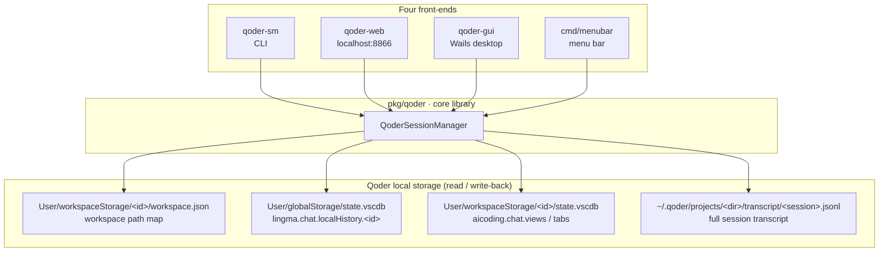
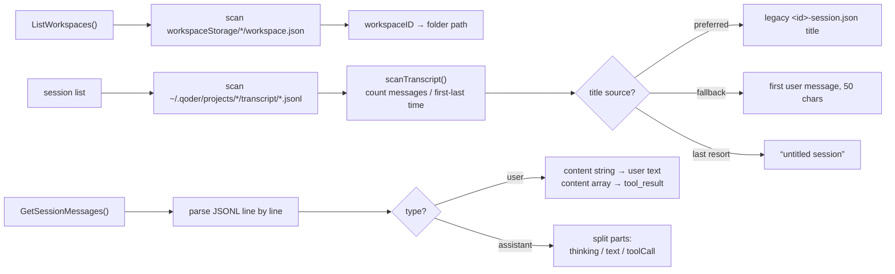
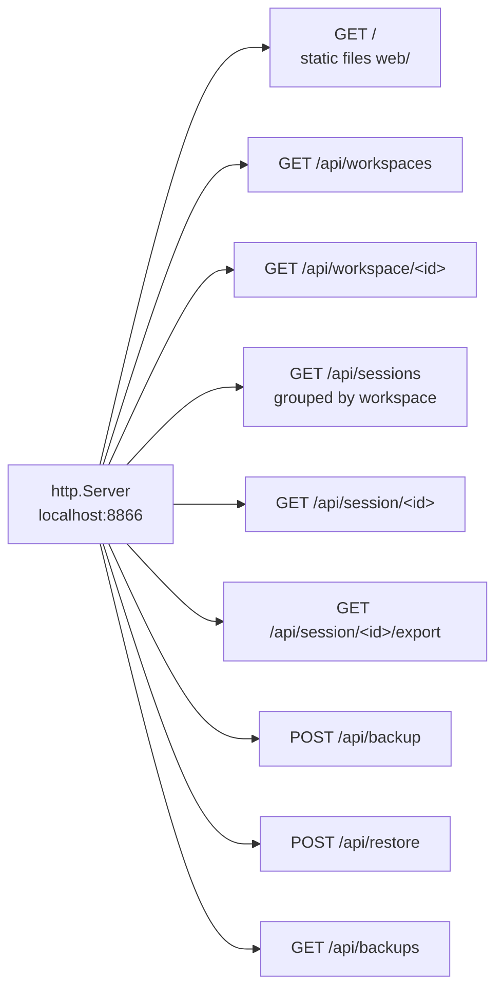
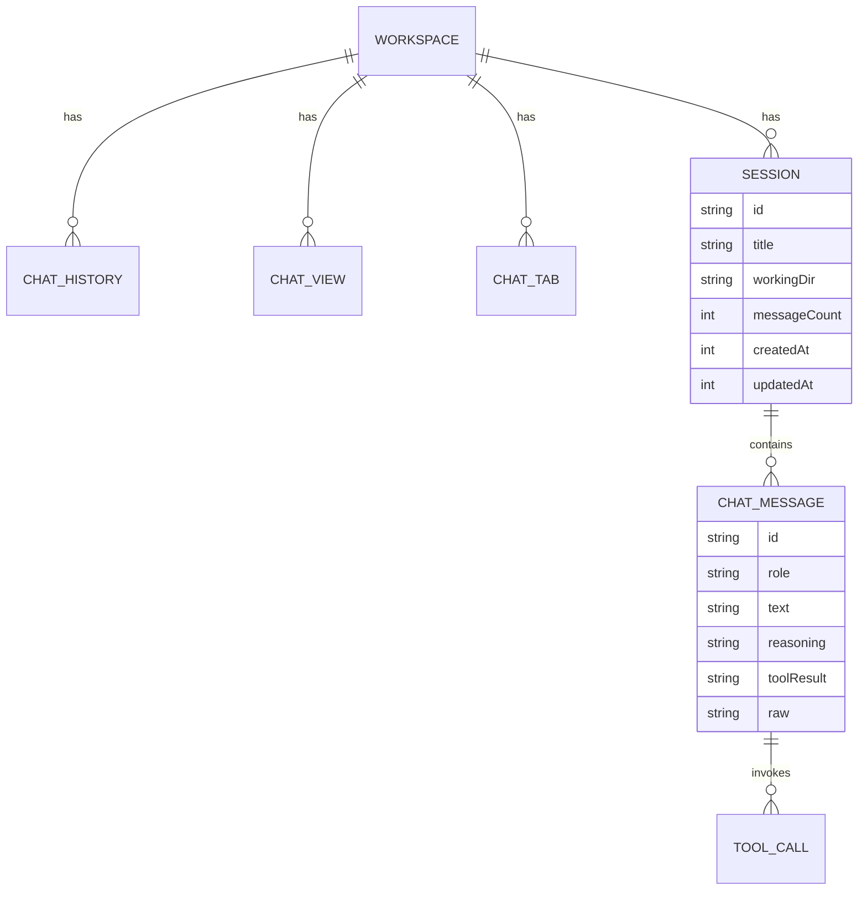

<div align="center">

> **English** | [简体中文](./README.md)


# QoderSM · Qoder Session Manager

**Stop losing your chats when you switch accounts — back up, restore and export every Qoder IDE session with one click.**

Turning "all my history vanished after switching users" into a single button.


</div>

---

## Why it exists

Qoder IDE stores each workspace's chat history **isolated by user identity** on your machine. The moment you switch accounts, the previous account's sessions **disappear** from the new account — they were never deleted, just locked behind the old identity, and Qoder offers no export or migration path.

**QoderSM reads Qoder's local session stores directly, backs them up, and writes them back after a switch.** Your history becomes searchable, migratable and archivable again.

> It does not modify Qoder, does not go online, and uploads nothing. It only reads/writes between
> `~/Library/Application Support/Qoder` and `~/.qoder` on your own machine.

---

## ✨ Features

- 🧭 **Four front-ends**: CLI, local Web, Wails desktop app, macOS menu bar
- 📁 **Browse by workspace**: sessions are grouped by working directory, showing model reasoning, text, tool calls and tool results
- 💾 **One-click full backup**: packs each workspace's chat history, views, tabs and **complete session messages** into a single JSON
- 🔄 **One-click restore**: writes the backup back into Qoder's storage; takes effect after a Qoder restart
- 📤 **Markdown export**: export one session or all of them as readable `.md` (including reasoning and tool calls)
- 🧩 **Dual-storage compatible**: understands both the legacy SQLite `state.vscdb` and the modern CLI `transcript/*.jsonl`

---

## 🚀 Quick Start

### Option 1 — For AI agents (one-shot install, recommended)

Paste the prompt below to your local AI agent (Claude Code / Codex / OpenCode …) and it will install everything:

````markdown
Please install QoderSM (GitHub: https://github.com/RayMorTwinkle/QoderSM).
Context: QoderSM backs up / restores Qoder IDE chat sessions lost when switching accounts.
It needs macOS + Go 1.21+ (and Xcode Command Line Tools for CGO).

Steps:
1. Clone: git clone https://github.com/RayMorTwinkle/QoderSM.git && cd QoderSM
2. Fetch deps: make deps
3. Build CLI + Web: make cli web
4. Verify CLI: ./build/bin/qoder-sm list   # should list all Qoder workspaces
5. Install Web app to /Applications: make install
6. Confirm success and briefly explain the four front-ends (CLI / Web / Desktop / Menu bar).
````

### Option 2 — For humans

```bash
git clone https://github.com/RayMorTwinkle/QoderSM.git
cd QoderSM
make deps          # go mod tidy
make cli web       # build CLI + Web binaries
make install       # package & install QoderSessionManager.app into /Applications
```

> **Requirements**: macOS 13+, Go 1.21+. This project uses `mattn/go-sqlite3` with CGO enabled,
> so Xcode Command Line Tools are required (`xcode-select --install`).

---

## 🖥️ Usage

### CLI (`qoder-sm`)

| Command | Purpose |
|---|---|
| `qoder-sm list` | List all workspaces and their session counts |
| `qoder-sm show <workspace-id>` | Show a workspace's sessions (views / tabs included) |
| `qoder-sm backup <workspace-id\|all>` | Back up one or all workspaces |
| `qoder-sm restore <backup-file>` | Restore from a backup file |
| `qoder-sm export <workspace-id\|all>` | Export to a readable text file |
| `qoder-sm list-backups [dir]` | List backups in the backup directory |

### The standard switch-and-restore flow

```text
Before switching account             After switching account
──────────────────────               ──────────────────────
1. Open QoderSM                      1. Open QoderSM
2. Click "Back up all sessions"      2. Click "View backups"
   (or qoder-sm backup all)          3. Pick a backup → "Restore"
3. Switch the account in Qoder       4. Restart Qoder to see the sessions
```

### Web / Desktop / Menu bar

- **Web**: `make web-run` starts a local server and opens `http://localhost:8866`
- **Desktop**: `cd qoder-gui && wails dev` (Wails 2 desktop app)
- **Menu bar**: `go run ./cmd/menubar`

---

## 🏗️ Architecture

### System overview

All four front-ends share the same core library `pkg/qoder`, which in turn talks to Qoder's two local storage layers.



### Data sources & parsing

QoderSM understands **both the legacy SQLite format and the modern CLI transcript format**, with tolerant field parsing.



### Backup sequence

```mermaid
sequenceDiagram
  autonumber
  participant U as User
  participant S as QoderSM
  participant Q as Qoder storage
  U->>S: qoder-sm backup all
  S->>Q: ListWorkspaces()
  Q-->>S: {workspaceID: folder}
  loop per workspace
    S->>Q: GetWorkspaceChatHistory(id)
    S->>Q: GetWorkspaceChatViews(id)
    S->>Q: GetWorkspaceChatTabs(id)
    S->>Q: ListSessions() + GetSessionMessages(id)
    Q-->>S: session metadata + messages (with Raw)
  end
  S->>S: assemble SessionBackup[] → JSON
  S-->>U: write ~/Documents/qoder-backups/qoder-backup-all-&lt;ts&gt;.json
```

### Restore sequence

```mermaid
sequenceDiagram
  autonumber
  participant U as User
  participant S as QoderSM
  participant Q as Qoder storage
  U->>S: qoder-sm restore &lt;backup.json&gt;
  S->>S: parse JSON (array or single-object)
  loop per workspace
    S->>Q: restoreChatHistory()<br/>INSERT OR REPLACE lingma.chat.localHistory.&lt;id&gt;.quest
    S->>Q: restoreChatViews() / restoreChatTabs()
    S->>Q: restoreSessions()<br/>rebuild transcript/&lt;id&gt;.jsonl
  end
  S-->>U: "restored — please restart Qoder"
```

> **Fail-safe**: restore prefers writing back the preserved `Raw` line from the backup; when `Raw` is
> missing, `rebuildMessageLine()` reconstructs a valid JSONL event from role / text / reasoning / toolCalls.

### Web API routes



### Data model



---

## 📂 Project layout

```text
QoderSM/
├── main_cli.go               # CLI entry (qoder-sm)
├── cmd/
│   ├── web/main.go           # Web server entry (qoder-web, port 8866)
│   ├── gui/main.go           # Wails desktop entry
│   └── menubar/main.go       # menu bar entry
├── pkg/qoder/
│   ├── core.go               # workspace scan / SQLite I/O / backup & restore
│   ├── sessions.go           # JSONL transcript parsing / session list / messages
│   └── webserver.go          # HTTP routes & Markdown export
├── qoder-gui/                # Wails desktop app (app.go + frontend)
├── web/index.html            # single-file Web frontend
├── Makefile                  # cli / web / install / clean / test
├── backup.sh                 # one-shot backup script
└── install.sh                # install script
```

---

## 🔧 Technical notes

**Two stores, two timelines.** Qoder's data model migrated from "VS Code-style SQLite" to "CLI JSONL transcripts"; QoderSM reads both:

| Layer | Location | Key / file |
|---|---|---|
| Workspace map | `User/workspaceStorage/<id>/workspace.json` | `folder` |
| Legacy history | `User/globalStorage/state.vscdb` | `lingma.chat.localHistory.<id>` (and `.quest`) |
| Legacy views | `User/workspaceStorage/<id>/state.vscdb` | `aicoding.chat.views` |
| Legacy tabs | `User/workspaceStorage/<id>/state.vscdb` | `aicoding.chat.tabs` |
| Modern transcript | `~/.qoder/projects/<dir>/transcript/<session>.jsonl` | one JSON event per line |

**Directory name ⇄ path.** Transcript dirs encode the path with hyphens (e.g. `-Users-ray-Downloads-SameMoon`); `workdirFromDirName()` restores it to `/Users/ray/Downloads/SameMoon`.

**Large-file safety.** The JSONL scanner raises its buffer to **1 MB / 64 MB per line** to avoid `token too long` on long transcript lines.

**Field compatibility.** `SessionInfo.UnmarshalJSON` accepts the snake_case fields of `-session.json`; `ChatViews.UnmarshalJSON` accepts both a bare array and a `{views:[...]}` object.

**Message parsing.** Each JSONL line is dispatched by `type`: `user`'s `content` may be a string (user text) or an array (`tool_result`); `assistant`'s `content` is a parts array split into `thinking` / `text` / `toolCall`.

**Lean Web responses.** `/api/session/<id>` clears each message's `Raw` field before responding, keeping payloads small.

---

## ❓ FAQ

**Q: Where are backups stored, and how long does restore take?**
A: By default in `~/Documents/qoder-backups/`. Restore is pure local SQLite + file writes and is usually instant — but you **must restart Qoder** to see the sessions.

**Q: Can it lose my sessions?**
A: Backup is **read-only**; restore uses `INSERT OR REPLACE`, overwriting only same-named keys. To be safe, back up the current state before restoring.

**Q: Why macOS only?**
A: It reads Qoder's fixed macOS paths (`~/Library/Application Support/Qoder`, `~/.qoder`). Other platforms are not adapted yet.

**Q: Why does `make install` need CGO?**
A: The SQLite driver `mattn/go-sqlite3` is a CGO implementation and needs a local C compiler (Xcode CLT).

---

## ⚠️ Notes

- This project reads/writes Qoder's **private local storage**; a Qoder update may change the storage format and require parser updates.
- **Restart Qoder** after restoring, and avoid using Qoder during a restore.
- Backups contain your **entire conversation content** — keep them safe and never upload them publicly.

---

## 📄 License

This repository currently ships no open-source license file. If you intend to distribute it or allow others to use it, consider adding one (e.g. MIT). Until then, all rights are reserved.

---

## 🙏 Credits

- This project is adapted from **[luckySpro/QoderSessionManager](https://github.com/luckySpro/QoderSessionManager)**. It extends the original with modern CLI `transcript/*.jsonl` parsing, `show` / `export` / `list-backups` subcommands and a menu-bar entry.
- Qoder session storage format reference: [Session Management — Qoder CLI](https://docs.qoder.com/cli/sessions).
- The icon, bilingual README and architecture diagrams in this repository are re-authored for this project.

---

<div align="center">
<sub>QoderSM · so that every account switch is no longer a goodbye</sub>
</div>
